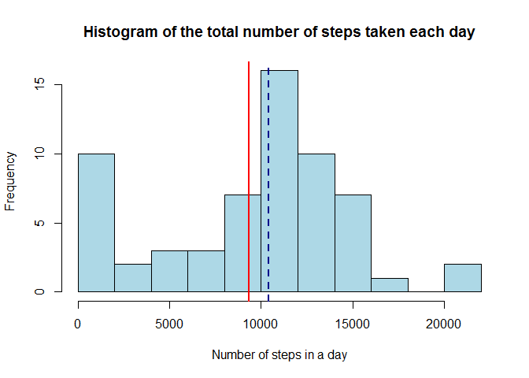
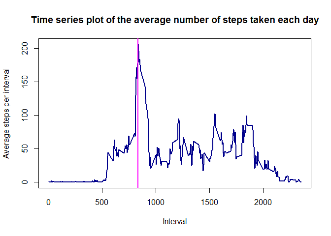
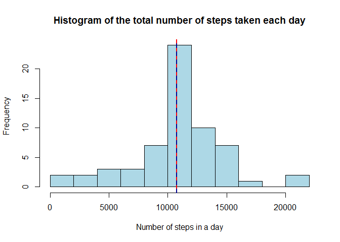
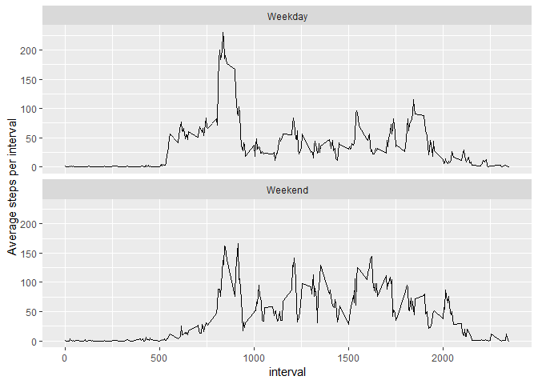

## Introduction
It is now possible to collect a large amount of data about personal movement using activity monitoring devices such as a Fitbit, Nike Fuelband, or Jawbone Up. These type of devices are part of the "quantified self" movement - a group of enthusiasts who take measurements about themselves regularly to improve their health, to find patterns in their behavior, or because they are tech geeks. But these data remain under-utilized both because the raw data are hard to obtain and there is a lack of statistical methods and software for processing and interpreting the data.

This assignment makes use of data from a personal activity monitoring device. This device collects data at 5 minute intervals through out the day. The data consists of two months of data from an anonymous individual collected during the months of October and November, 2012 and include the number of steps taken in 5 minute intervals each day.

The data for this assignment can be downloaded from the course web site.

The variables included in this dataset are:

1. steps: Number of steps taking in a 5-minute interval (missing values are coded as NA)
2. date: The date on which the measurement was taken in YYYY-MM-DD format
3. interval: Identifier for the 5-minute interval in which measurement was taken
The dataset is stored in a comma-separated-value (CSV) file and there are a total of 17,568 observations in this dataset.


## Loading the data and necessary libraries

```r
library(ggplot2)
library(dplyr)
```

```
## 
## Attaching package: 'dplyr'
```

```
## The following objects are masked from 'package:stats':
## 
##     filter, lag
```

```
## The following objects are masked from 'package:base':
## 
##     intersect, setdiff, setequal, union
```

```r
library(data.table)
```

```
## 
## Attaching package: 'data.table'
```

```
## The following objects are masked from 'package:dplyr':
## 
##     between, first, last
```

```r
library(ggthemes)
activity <- read.csv("activity.csv")
```

## Calculating the mean total number of steps taken per day and plotting it

```r
#Calculating total number of steps grouped by date
activity_date <- activity %>% group_by(date) %>% summarize(totalSteps = sum(steps, na.rm=TRUE))

#Calculating mean and median of steps per day
meanSteps <- mean(activity_date$totalSteps)
medianSteps <- median(activity_date$totalSteps)

#Plotting the histograms
hist(activity_date$totalSteps, breaks=15,col="lightblue" ,main="Histogram of the total number of steps taken each day", xlab="Number of steps in a day")
abline(v=meanSteps, col="red", lw=2,lty=1)
abline(v=medianSteps, col="darkblue", lw=2,lty=2)
```

<!-- -->

The red color line displays the mean while the blue dotted line represents the median. Here the mean is 9354.2295082 and median is 10395.

## Calculating the average daily activity pattern


```r
#Calculating total number of steps grouped by interval
activity_interval <- activity %>% group_by(interval) %>% summarize(avgSteps = mean(steps, na.rm=TRUE))

#Plotting the time-series plot
plot(activity_interval$interval, activity_interval$avgSteps, col="darkblue", xlab="Interval",ylab="Average steps per interval",main="Time series plot of the average number of steps taken each day", type="l", lwd=2)
max <- activity_interval$interval[which.max(activity_interval$avgSteps)]
abline(v=max, col="magenta", lw=2,lty=1)
```

<!-- -->

We can see that the interval 835 records the maximum activity in a day. This is represented by the magenta line in the plot.

## Imputing missing values
We are now going to analyze and impute missing data.


```r
##calculate the total number of rows with NAs
sum(is.na(activity$interval))
```

```
## [1] 0
```

```r
sum(is.na(activity$steps))
```

```
## [1] 2304
```

```r
sum(is.na(activity$date))
```

```
## [1] 0
```

We can see here there are no NA values for either interval or date and there are 2304 NA values in steps. 
We will use a stretegy to fill up the NA values so that we do not get a biased summary of the data. We will fill the NA values with the mean of the number of steps for that particular date/interval.
Now we will investigate how many NA's are there for each date.


```r
activity %>% group_by(date) %>% summarize(TotalEntries=n(),NAs=sum(is.na(steps)))
```

```
## # A tibble: 61 x 3
##    date       TotalEntries   NAs
##    <fct>             <int> <int>
##  1 2012-10-01          288   288
##  2 2012-10-02          288     0
##  3 2012-10-03          288     0
##  4 2012-10-04          288     0
##  5 2012-10-05          288     0
##  6 2012-10-06          288     0
##  7 2012-10-07          288     0
##  8 2012-10-08          288   288
##  9 2012-10-09          288     0
## 10 2012-10-10          288     0
## # ... with 51 more rows
```

From these results we see that for certain dates all the entries for steps are NAa. So we can not impute these NA values with means from dates. Let's look at intervals.


```r
activity %>% group_by(interval) %>% summarize(TotalEntries=n(),NAs=sum(is.na(steps)))
```

```
## # A tibble: 288 x 3
##    interval TotalEntries   NAs
##       <int>        <int> <int>
##  1        0           61     8
##  2        5           61     8
##  3       10           61     8
##  4       15           61     8
##  5       20           61     8
##  6       25           61     8
##  7       30           61     8
##  8       35           61     8
##  9       40           61     8
## 10       45           61     8
## # ... with 278 more rows
```

From these values it looks like there are some values per intervals which are not NA, so we will use the mean of them to fill up.


```r
NA2mean <- function(x) replace(x, is.na(x), mean(x, na.rm = TRUE))
activity<- activity %>% group_by(interval) %>% mutate(steps=NA2mean(steps))
sum(is.na(activity$steps))
```

```
## [1] 0
```
The NA values are successfully imputed. We will plot the histogram again

```r
activity_date <- activity %>% group_by(date) %>% summarize(totalSteps = sum(steps))

#Calculating the mean and median of steps per day
mean_new <- mean(activity_date$totalSteps)
median_new <- median(activity_date$totalSteps)

#Plotting the histograms
hist(activity_date$totalSteps, breaks=15, col="lightblue", xlab="Number of steps in a day",main="Histogram of the total number of steps taken each day")
abline(v=mean_new, col="red", lw=2,lty=1)
abline(v=median_new, col="darkblue", lw=2,lty=2)
```

<!-- -->

After imputing for NA values, the new mean and median values are same which is 1.0766189\times 10^{4}.

## Calculating differences in activity patterns between weekdays and weekends


```r
#Will add a column containing the day of the week for each date
activity$day <- weekdays(as.Date(activity$date))

#Now we will add another column indicating if it's a weekday or weekend
for(i in 1:nrow(activity)){
    if (activity$day[i] %in% c("Monday","Tuesday","Wednesday","Thursday","Friday")){
        activity$weekday[i] <- "Weekday"
    }else if(activity$day[i] %in% c("Saturday","Sunday")){
        activity$weekday[i] <- "Weekend"
    }
}
```

```
## Warning: Unknown or uninitialised column: 'weekday'.
```

```r
table(activity$weekday)
```

```
## 
## Weekday Weekend 
##   12960    4608
```

We will plot a time series plot of the 5-minute interval and the average number of steps taken, averaged across all weekday days or weekend days


```r
#Calculating total number of steps grouped by interval and weekday
activity = data.table(activity)
activity_by_weekday = activity[,list(avgSteps = mean(steps)), by = 'interval,weekday']

#Plotting the time-series plot
activity_by_weekday %>% ggplot(aes(interval, avgSteps)) + geom_line() + facet_wrap(.~weekday,ncol = 1, nrow=2) + labs(y="Average steps per interval")
```

<!-- -->

```r
dev.off()
```

```
## null device 
##           1
```
